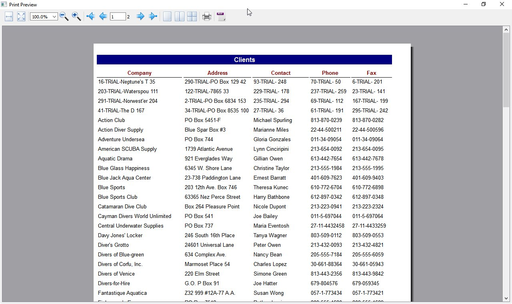
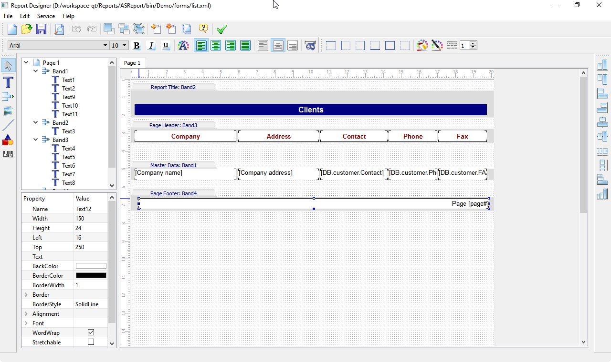
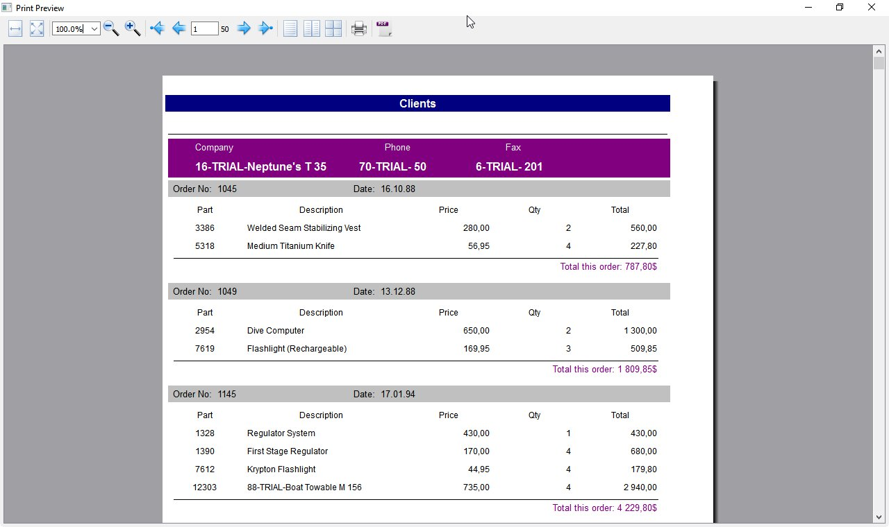
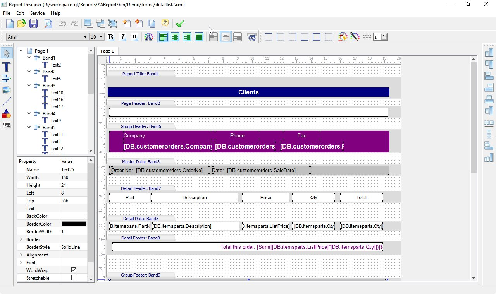
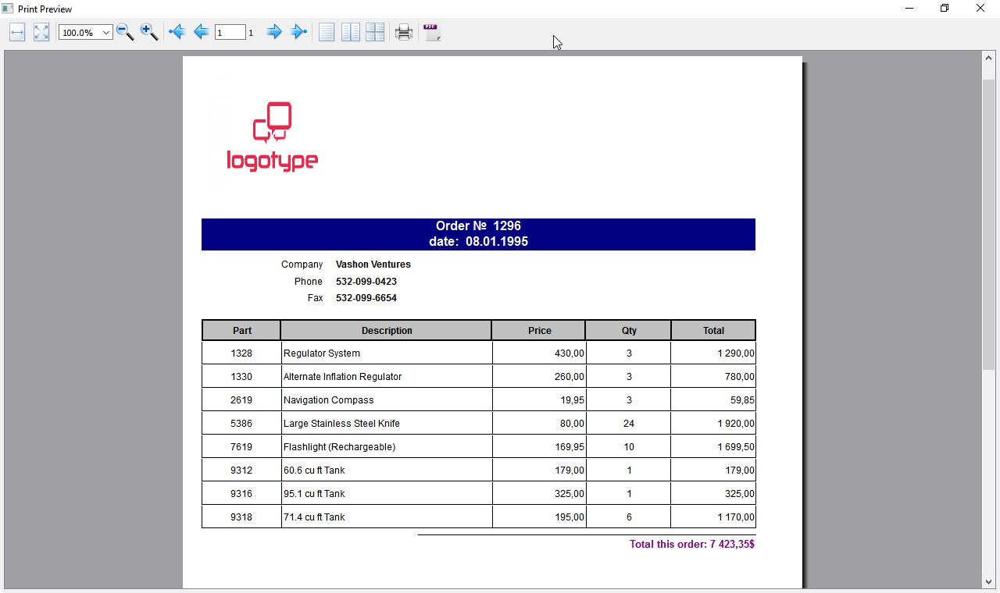
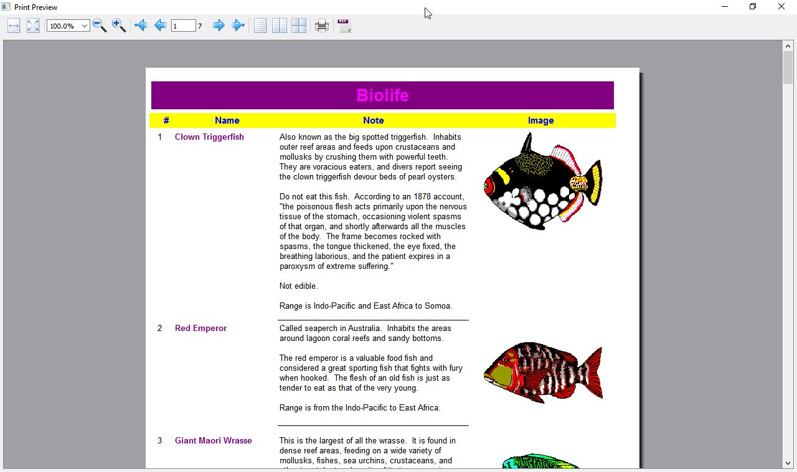

# QASreport

Original Repository: https://sourceforge.net/projects/qasreport/

QASreport - is a multi-platform C ++ Qt library that contains a set of classes for building reports. It is a mix of designer and report generator output means. It is intended to add to the application of automation to create, save, report output. Reports templates are stored in XML format. And can be stored and loaded from a file on disk, memory, or table blob fields. The library contains built-in designer, available in run-time, with the ability to work like a normal graphic editor. Possible conclusion of the tables of any SQL database, which is connected to the driver. And the output of any source data models, inherited from QAbstractItemModel.

## Features
* Report generator based on the band;
* Built-in designer, available in run-time, with the ability to work like a normal graphic editor;
* The conclusion of the report results in the Preview;
* Any number of pages in the report;
* Multiple reports, the possibility of drawing up a number of reports and forms in a single file;
* Save the report file format - XML;
* Master-detail reports;
* Full control over the printing process, support of any type of paper and printing devices;
* Easy to design a report using simple components: a text box, line, image, shape, and bar-code;
* The output data of any database, which the driver is installed;

